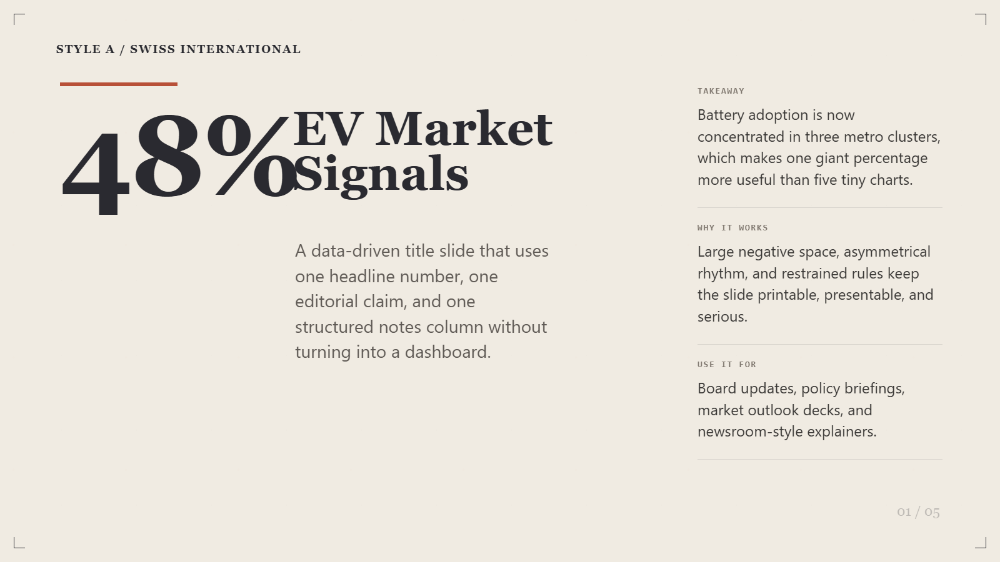
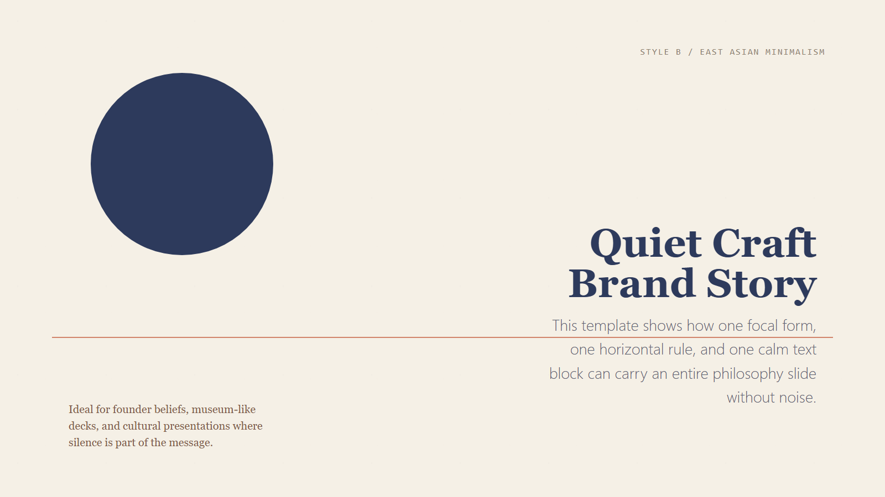
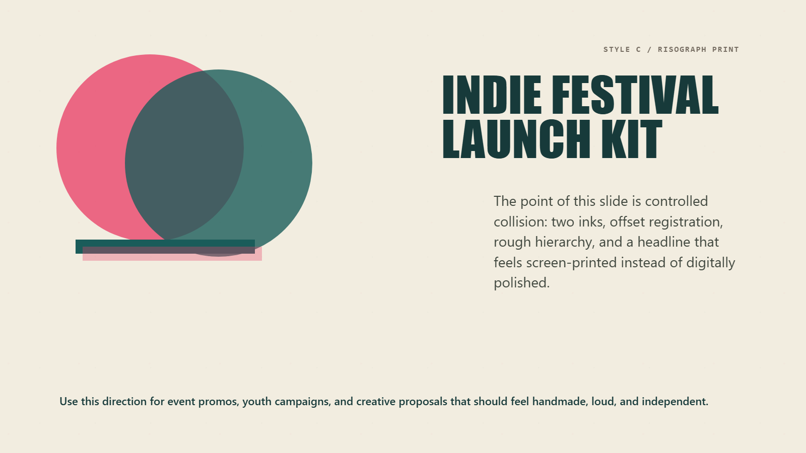
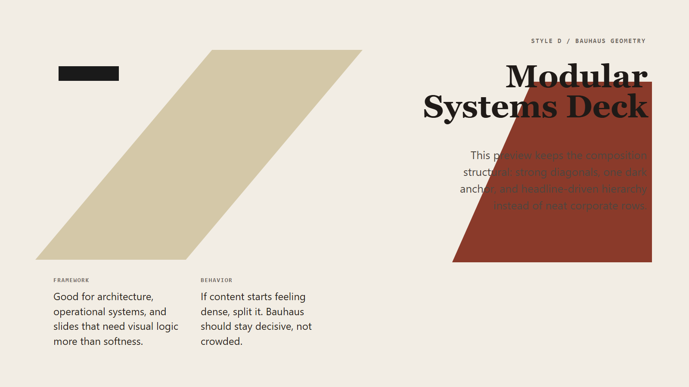
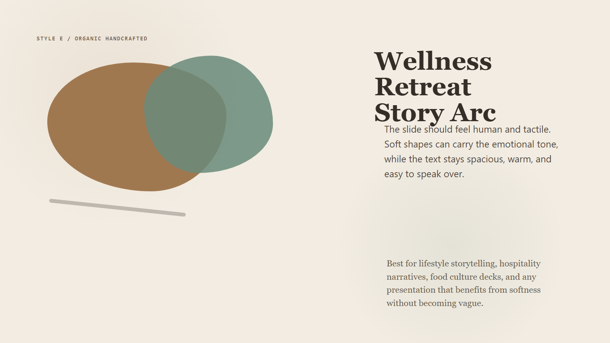
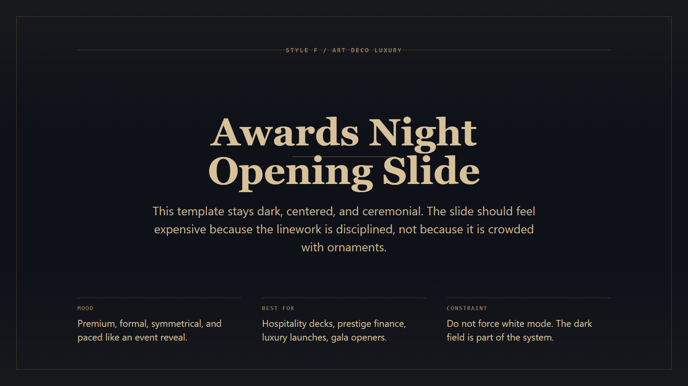
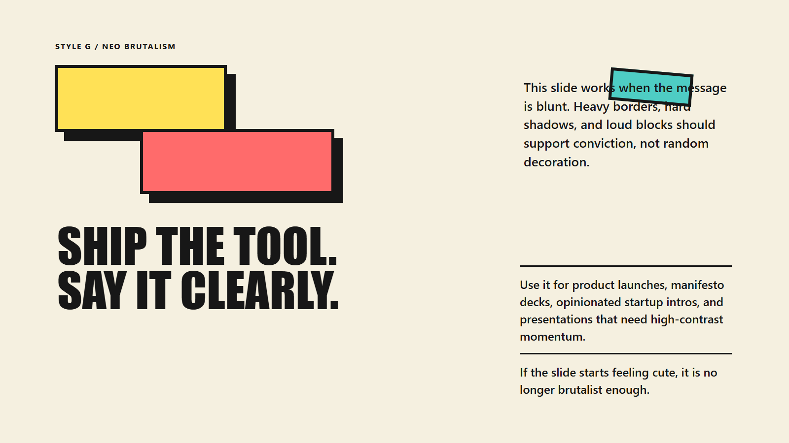
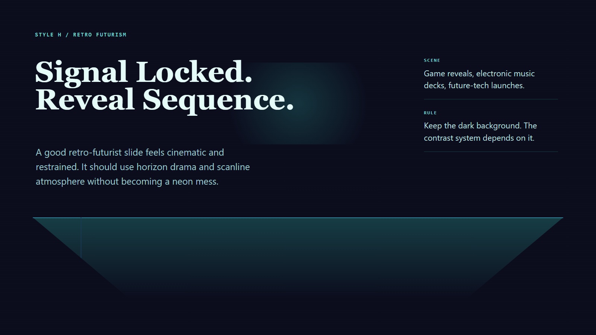
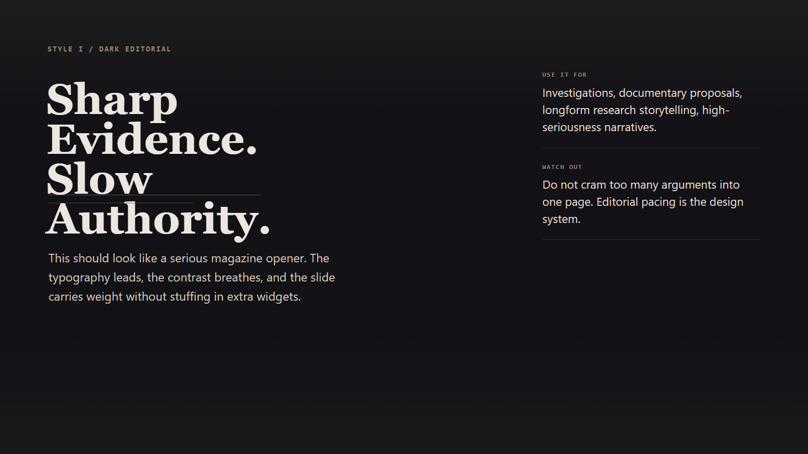
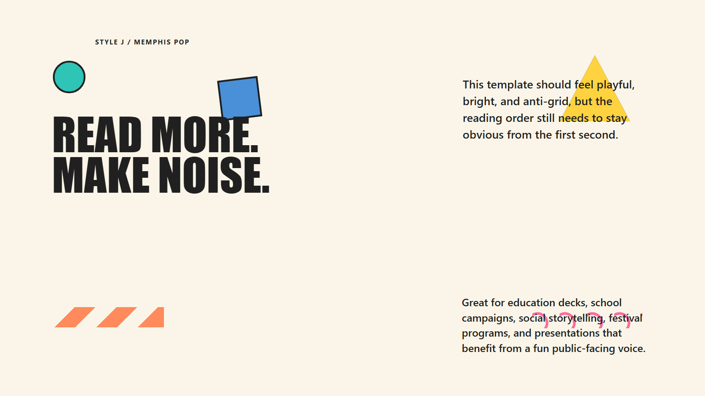

# PPT Design

Language: **English** | [简体中文](./README.zh.md) | [繁體中文](./README.zh-TW.md)


`ppt-design` is a presentation-design skill for turning page-structured Markdown into polished `1600x900` HTML slides, then exporting those slides to a high-fidelity image-based PPTX when needed.

It is designed to work in both Codex and Claude Code workflows. The repository root is the full development workspace. `skills/ppt-design/` is the distributable skill bundle that mirrors the shared skill content.

Current release:

- [`v0.3.0 release notes`](./RELEASE_NOTES_v0.3.0.md)

## Quick Start

1. Install dependencies with `npm install` and `npx playwright install chromium`.
2. Prepare one Markdown file grouped by `Page 1`, `Page 2`, and so on.
3. Let the skill choose a style or specify one directly.
4. Generate HTML slides, review them, then export to PNG or PPTX when needed.

If you want a ready-made starting point, begin with the generic deck templates in [`cases/templates/`](./cases/templates/).

## What It Does

- Recommends a fitting visual style when the user has not chosen one.
- Accepts page-by-page Markdown as the primary content handoff format.
- Supports Chinese and bilingual slide decks with per-style font pairing rules.
- Supports `background_mode=paper|white` for compatible light styles.
- Classifies each slide by content role before choosing a layout prototype.
- Enforces a fixed safe content frame so primary content stays presentation-safe.
- Preserves geometry-sensitive diagrams and strict tables when structure carries meaning.
- Reviews every generated HTML slide for overlap, clipping, and readability.
- Supports `presentation_scenario`, `quality_tier`, brand locks, and speaker-notes sidecars for public-stage decks.
- Produces rubric-based audit reports for public-stage review instead of relying on layout checks alone.
- Treats bundled public-stage demos as internal benchmark artifacts, not default public showcase material.
- Exports finished HTML slides to PNG and then to PPTX.

## Typical Use Cases

- Business and policy decks that need disciplined hierarchy and presentation-safe typography.
- Brand, culture, and exhibition decks that need stronger visual direction than standard slide templates.
- Chinese and bilingual presentations that need style-aware font pairing instead of generic fallback fonts.
- Static HTML-to-PPT workflows where final visual fidelity matters more than editable PowerPoint primitives.

## Current Workflow

The core workflow is defined in [`SKILL.md`](./SKILL.md) and mirrored in [`skills/ppt-design/SKILL.md`](./skills/ppt-design/SKILL.md).
Runtime behavior is enforced by the shared engine under [`scripts/slide_engine/`](./scripts/slide_engine/).
The Markdown style files in [`styles/`](./styles/) remain design references and must stay manually synced with that executable manifest.

The important reference chain is:

1. [`references/style-selector.md`](./references/style-selector.md)
2. [`references/bilingual-typography.md`](./references/bilingual-typography.md) when the deck is Chinese or bilingual
3. [`references/background-modes.md`](./references/background-modes.md)
4. [`references/presentation-layout-rules.md`](./references/presentation-layout-rules.md)
5. [`references/html-review-checklist.md`](./references/html-review-checklist.md)
6. [`references/presentation-quality-rubric.md`](./references/presentation-quality-rubric.md)
7. [`references/layout-prototypes.md`](./references/layout-prototypes.md)
8. [`references/safe-zone.md`](./references/safe-zone.md)
9. [`references/geometry-preserve.md`](./references/geometry-preserve.md) for diagrams and strict tables
10. The chosen style file in [`styles/`](./styles/)

The workflow is content-first:

1. Read Markdown grouped by `Page 1`, `Page 2`, and so on.
2. Infer the role of each slide, such as `cover`, `metric`, `comparison`, or `closing`.
3. Select a layout prototype based on style family and content role.
4. Keep primary content inside the slide safe zone.
5. Preserve diagram geometry when the page contains framework maps, box structures, org charts, or strict tables.
6. Generate one HTML file per slide.
7. Review and revise before delivery.
8. Export to PPT only when needed.

## Public-Stage Task Flow

For public-facing decks, the canonical flow is no longer "generate once and export".
Use a task pipeline instead:

1. Draft generation
2. Polish pass
3. Audit gate
4. Render / export

The public-stage builder writes task artifacts per style directory:

- `task-report.md`
- `task-report.json`
- `deck-manifest.json`
- `speaker-notes.md`

Run the full public-stage benchmark pipeline with:

```powershell
npm run build:public-stage
```

## Layout And Safe Zone Contract

The current system is no longer a loose “fill the page” template. It uses a fixed slide contract:

- Slide canvas: `1600 x 900`
- Main content frame: `y = 108px` to `y = 804px`
- Top reserved zone: `0-96px`
- Bottom reserved zone: `804-900px`
- Primary content must live inside `.main-frame`
- Chrome labels are controlled by `chrome=all|bookend|none`
- Default chrome mode is `bookend`

See:

- [`references/layout-prototypes.md`](./references/layout-prototypes.md)
- [`references/safe-zone.md`](./references/safe-zone.md)
- [`references/geometry-preserve.md`](./references/geometry-preserve.md)

## Style Gallery

The skill currently ships with 10 styles. The gallery below is the fastest way to understand the system visually before reading the full rules.

### At A Glance

| A. Swiss International | B. East Asian Minimalism |
|---|---|
|  |  |
| `editorial` • grid-first, rational, asymmetrical | `minimal` • quiet, spacious, reflective |

| C. Risograph Print | D. Bauhaus Geometry |
|---|---|
|  |  |
| `poster` • indie print, layered, rough | `geometry` • structural, bold, modernist |

| E. Organic Handcrafted | F. Art Deco Luxury |
|---|---|
|  |  |
| `organic` • tactile, warm, human | `luxury` • dark, ceremonial, symmetrical |

| G. Neo Brutalism | H. Retro Futurism |
|---|---|
|  |  |
| `brutal` • loud, hard-edged, startup-forward | `future` • neon, horizon-grid, retro-tech |

| I. Dark Editorial | J. Memphis Pop |
|---|---|
|  |  |
| `dark-editorial` • premium, serious, magazine-like | `playful` • bright, anti-grid, energetic |

### Style Profiles

| Style | Name | Family | Best For | `white` |
|---|---|---|---|---|
| A | Swiss International | editorial | business reports, finance, policy, newsroom summaries | Yes |
| B | East Asian Minimalism | minimal | brand values, exhibitions, culture, philosophy | Yes |
| C | Risograph Print | poster | creative proposals, indie brands, event promos | Yes |
| D | Bauhaus Geometry | geometry | architecture, design talks, product frameworks | Yes |
| E | Organic Handcrafted | organic | wellness, food, culture, lifestyle storytelling | Yes |
| F | Art Deco Luxury | luxury | luxury, hospitality, awards, prestige finance | No |
| G | Neo Brutalism | brutal | startup launches, opinionated decks, bold messaging | Yes |
| H | Retro Futurism | future | gaming, tech launches, sci-fi themes, electronic music | No |
| I | Dark Editorial | dark-editorial | investigations, documentaries, deep research | No |
| J | Memphis Pop | playful | education, entertainment, social campaigns, festivals | Yes |

Detailed selection guidance lives in:

- [`references/style-selector.md`](./references/style-selector.md)
- [`styles/`](./styles/)

## Repository Structure

```text
ppt-design/
|- SKILL.md
|- CLAUDE.md
|- references/
|  |- background-modes.md
|  |- bilingual-typography.md
|  |- deck-markdown-template.md
|  |- geometry-preserve.md
|  |- html-review-checklist.md
|  |- layout-prototypes.md
|  |- presentation-quality-rubric.md
|  |- presentation-layout-rules.md
|  |- safe-zone.md
|  `- style-selector.md
|- styles/
|  |- style_a.md
|  |- ...
|  `- style_j.md
|- scripts/
|  |- render_slides.mjs
|  |- export_ppt.mjs
|  |- build_twitter_style_cases.mjs
|  |- check_shared_engine_usage.mjs
|  |- build_review_sheets.mjs
|  |- generate_style_previews.mjs
|  |- slide_engine/
|  `- twitter_style_cases/
|- skills/
|  `- ppt-design/
|     |- SKILL.md
|     |- references/
|     |- styles/
|     `- scripts/
`- outputs/
   |- html/
   |- rendered/
   `- ppt/
```

## Root Workspace vs Skill Bundle

The repository root is the full working project:

- `package.json` and `package-lock.json`
- development scripts
- preview assets
- example generation and audit scripts
- Claude Code project entrypoint

`skills/ppt-design/` is the portable skill payload:

- shared `SKILL.md`
- shared references
- shared styles
- shared `render_slides.mjs` and `export_ppt.mjs`

This means:

- the core skill workflow is identical in both places
- the root is the complete superset
- `skills/ppt-design/` is suitable as a distribution bundle
- standalone dependency installation still happens from the root in this repo

## Entry Points

- [`SKILL.md`](./SKILL.md) is the core skill workflow.
- [`CLAUDE.md`](./CLAUDE.md) contains repo-local guidance for assistant-driven development.

## Setup

Install dependencies:

```powershell
npm install
npx playwright install chromium
```

## Main Commands

Render HTML slides to PNG:

```powershell
node .\scripts\render_slides.mjs --input .\outputs\html --output .\outputs\rendered
```

Export PNG slides to PPTX:

```powershell
node .\scripts\export_ppt.mjs --input .\outputs\rendered --output .\outputs\ppt\deck.pptx
```

Run both:

```powershell
npm run build:ppt
```

Build style preview assets:

```powershell
npm run build:style-previews
```

Build the full public-stage internal benchmark:

```powershell
npm run build:public-stage
```

Check that all pipelines still route through the shared engine:

```powershell
npm run check:shared-engine
```

## PPT Export Metadata

PPT author and company are environment-driven:

```powershell
$env:PPT_AUTHOR = "Your Name"
$env:PPT_COMPANY = "Your Team"
```

If unset, the export falls back to:

- `PPT_AUTHOR`: `AI Agent`
- `PPT_COMPANY`: `PPT Design Skill`

## Recommended Markdown Input

The preferred input is one Markdown file already grouped by slide.

Example:

```markdown
# Page 1
## Title
2026 Market Outlook

## Subtitle
Why Southeast Asia matters now

## Key Points
- EV penetration accelerated in three urban clusters
- Battery localization is improving margin outlook
- Policy support remains uneven by country

# Page 2
## Title
Key Drivers

## Sections
### Demand
- Fleet adoption
- Urban charging growth
```

Reusable template:

- [`references/deck-markdown-template.md`](./references/deck-markdown-template.md)

## Template Library

This repo now treats templates as the primary starting point instead of a single named-topic benchmark.

Recommended starting files:

- [`references/deck-markdown-template.md`](./references/deck-markdown-template.md)
- [`cases/templates/five-slide-generic.md`](./cases/templates/five-slide-generic.md)
- [`cases/templates/five-slide-generic.zh.md`](./cases/templates/five-slide-generic.zh.md)
- [`cases/templates/ten-slide-generic.zh.md`](./cases/templates/ten-slide-generic.zh.md)

Use these when you want:

- a neutral structure with no fixed subject matter
- a reusable deck skeleton for internal workflows
- a clean starting point before applying any specific style

If you need a full product-grade verification run, the canonical benchmark is now:

```powershell
npm run build:public-stage
```

The repo demo builders are fixed internal benchmark pipelines:

- they exist as internal benchmark and release-gate pipelines
- public-stage runs use `draft -> polish -> audit -> render/export`
- they are not the default outward-facing demo story for the repository

## Quality Standard

This skill is intentionally stricter than a normal HTML generator.

Every generated slide should satisfy:

- no text collision
- no clipping
- readable type at presentation distance
- strong hierarchy for text-heavy content
- slide-safe spacing and padding
- all main content inside `.main-frame`
- no accidental text in reserved chrome zones
- no repeated layout prototype on consecutive slides

The review rules live in:

- [`references/presentation-layout-rules.md`](./references/presentation-layout-rules.md)
- [`references/html-review-checklist.md`](./references/html-review-checklist.md)
- [`references/presentation-quality-rubric.md`](./references/presentation-quality-rubric.md)

## Outputs

- HTML slides: [`outputs/html/`](./outputs/html/)
- rendered PNGs: [`outputs/rendered/`](./outputs/rendered/)
- PPTX decks: [`outputs/ppt/`](./outputs/ppt/)

## Notes

- The root repo includes helper and audit scripts that are not part of the minimal distribution bundle.
- Existing smoke-test HTML files under `outputs/html/` are just local artifacts, not the canonical layout template.
- The canonical behavior should always be taken from `SKILL.md` plus the reference documents.
