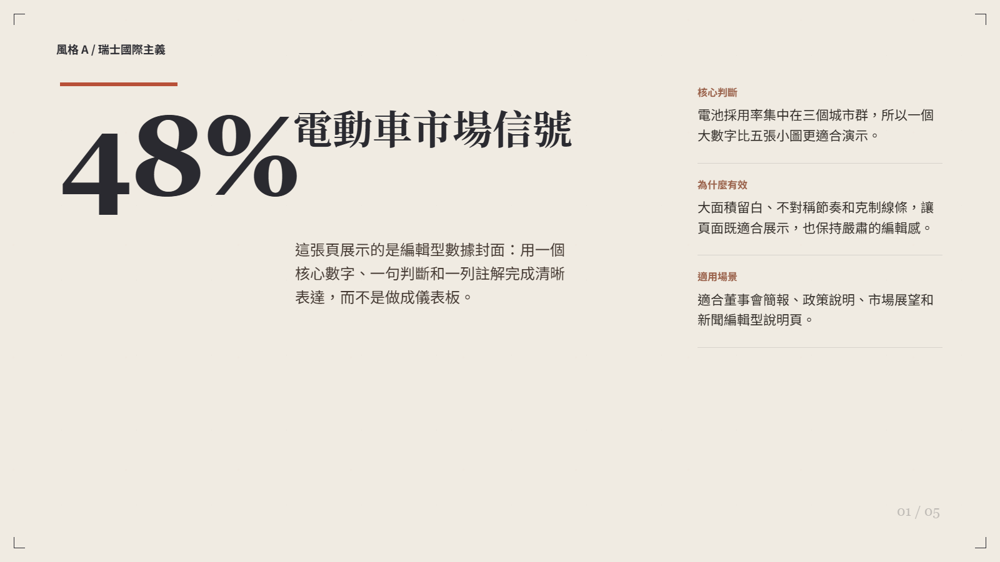
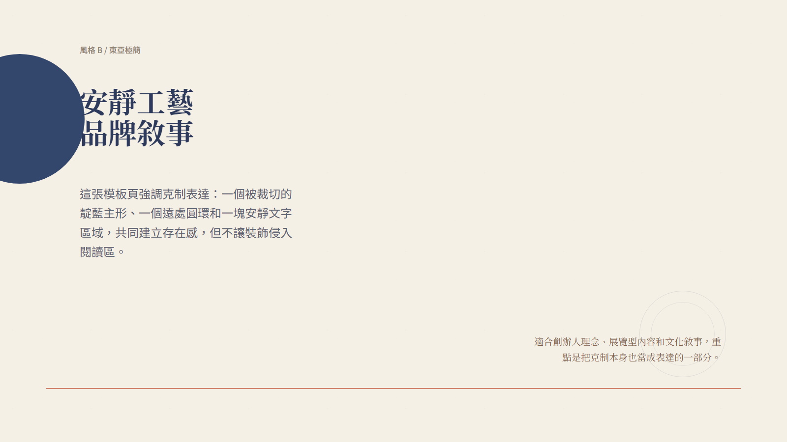
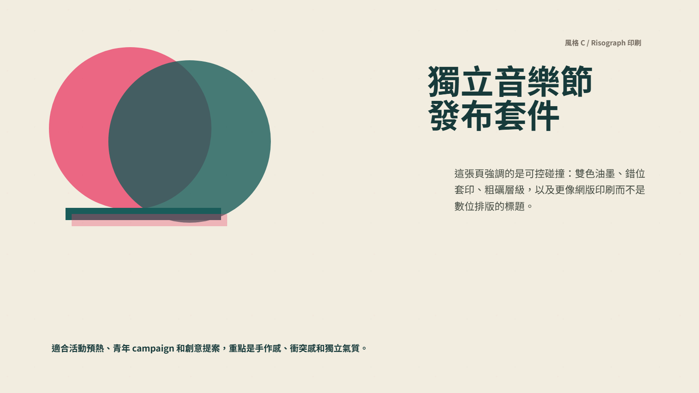
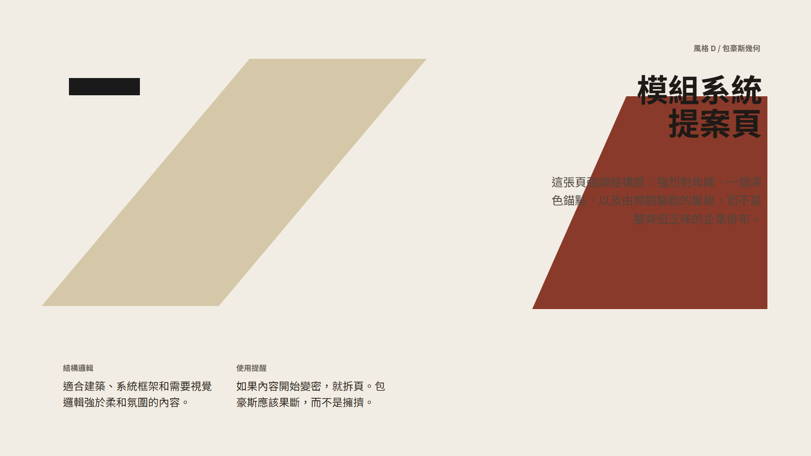
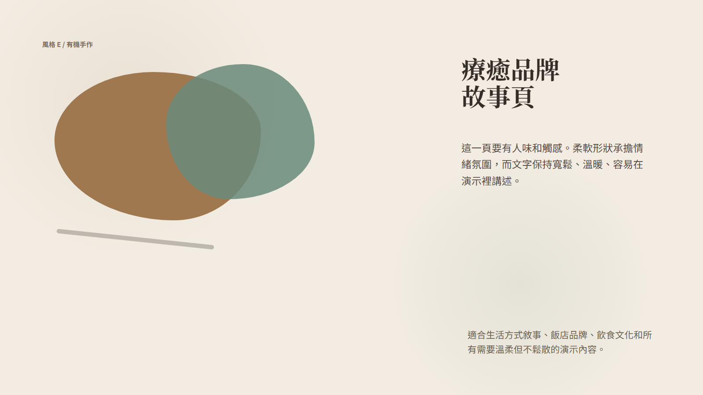
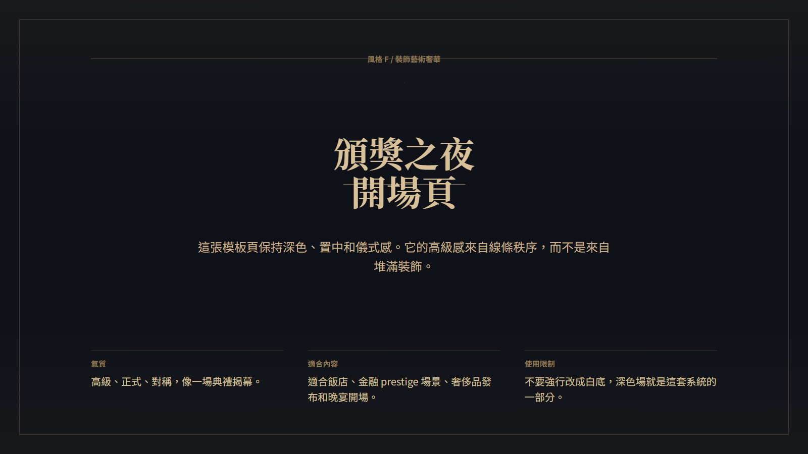
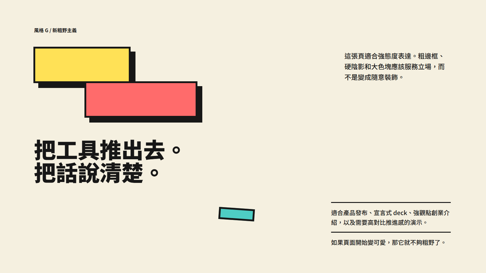
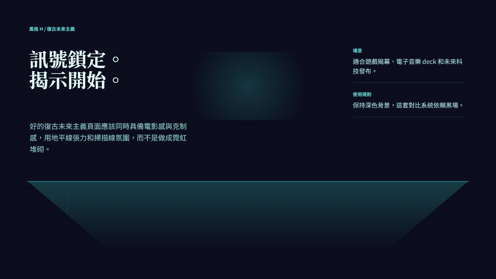
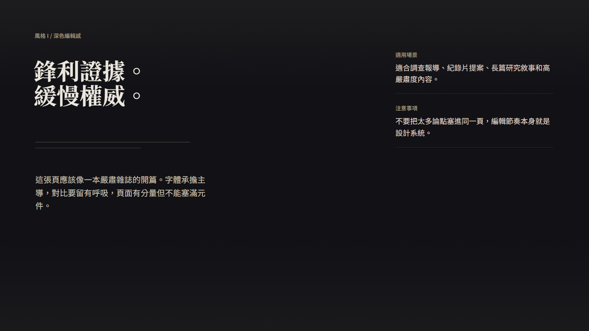
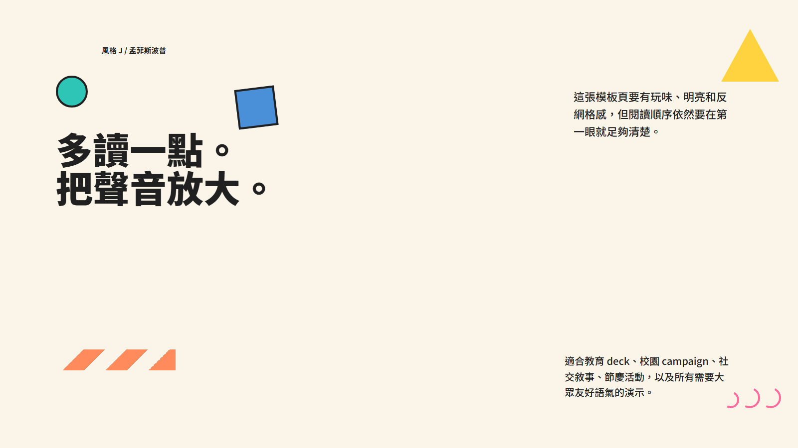

# PPT Design 繁體中文說明

語言： [English](./README.md) | [简体中文](./README.zh.md) | **繁體中文**


`ppt-design` 是一套面向演示稿設計的 skill，用來把按頁組織好的 Markdown 轉成 `1600x900` 的 HTML slides，並在需要時進一步匯出成高保真的圖片式 PPTX。

它同時支援 Codex 與 Claude Code 工作流。倉庫根目錄是完整開發工作區；`skills/ppt-design/` 是可分發的 skill bundle，鏡像了共享的 skill 內容。

當前版本：

- [`v0.2.1 更新說明`](./RELEASE_NOTES_v0.2.1.md)

## 快速開始

1. 先執行 `npm install` 和 `npx playwright install chromium`。
2. 準備一份按 `Page 1`、`Page 2` 組織好的 Markdown。
3. 讓 skill 自動推薦 style，或直接指定 style。
4. 先生成 HTML slides，審查後再按需匯出 PNG 或 PPTX。

如果你想直接開始使用，建議先從 [`cases/templates/`](./cases/templates/) 裡的通用模板入手。

## 它能做什麼

- 當使用者未指定風格時，推薦合適的 style。
- 以按頁組織的 Markdown 作為主要輸入格式。
- 支援中文與中英混排，並依 style 套用不同字體配對規則。
- 支援相容淺色風格的 `background_mode=paper|white`。
- 在寫 HTML 前先識別每頁內容角色，再選 layout prototype。
- 強制使用安全內容邊界，保證主內容停留在演示安全區內。
- 每頁生成後都做版式審查，檢查越界、碰撞與可讀性。
- 最終把 HTML slides 匯出成 PNG，再匯出成 PPTX。

## 典型使用場景

- 需要嚴謹層級與投影可讀性的商業簡報、政策摘要、研究總結。
- 需要比一般模板更強視覺方向的品牌、文化、展覽型 deck。
- 需要依 style 處理中英文字體關係的中文或雙語演示稿。
- 需要透過靜態 HTML 保真匯出 PPTX，而不是依賴可編輯 PowerPoint 原生物件的場景。

## 當前工作流

核心工作流定義在：

- [`SKILL.md`](./SKILL.md)
- [`skills/ppt-design/SKILL.md`](./skills/ppt-design/SKILL.md)

關鍵參考文件鏈路如下：

1. [`references/style-selector.md`](./references/style-selector.md)
2. [`references/bilingual-typography.md`](./references/bilingual-typography.md)（僅中文或雙語 deck 需要）
3. [`references/background-modes.md`](./references/background-modes.md)
4. [`references/presentation-layout-rules.md`](./references/presentation-layout-rules.md)
5. [`references/html-review-checklist.md`](./references/html-review-checklist.md)
6. [`references/layout-prototypes.md`](./references/layout-prototypes.md)
7. [`references/safe-zone.md`](./references/safe-zone.md)
8. 選中的 style 文件，位於 [`styles/`](./styles/)

整個流程是內容優先的：

1. 讀取按 `Page 1`、`Page 2` 組織的 Markdown。
2. 識別每頁屬於 `cover`、`metric`、`comparison`、`closing` 等內容角色。
3. 根據 style family 與內容角色選擇 layout prototype。
4. 保證主內容始終落在 slide safe zone 內。
5. 每頁輸出一個 HTML 檔案。
6. 審查並修正後再交付。
7. 只在需要時匯出 PPT。

## 版式與安全區約束

當前系統已經不是「整頁隨意鋪內容」的模板，而是固定的 slide 合同：

- 畫布：`1600 x 900`
- 主內容區：`y = 108px` 到 `y = 804px`
- 頂部預留區：`0-96px`
- 底部預留區：`804-900px`
- 所有主內容都必須放在 `.main-frame` 內
- chrome labels 由 `chrome=all|bookend|none` 控制
- 預設 chrome 模式為 `bookend`

詳見：

- [`references/layout-prototypes.md`](./references/layout-prototypes.md)
- [`references/safe-zone.md`](./references/safe-zone.md)

## 風格畫廊

當前 skill 內建 10 套 style。先看截圖總覽，再決定是否深入閱讀每套 style 的細則，會更像在看一份產品文件而不是純文字說明。

### 一屏總覽

| A. Swiss International | B. East Asian Minimalism |
|---|---|
|  |  |
| `editorial` • 網格明確、理性、編輯感 | `minimal` • 安靜、留白大、克制 |

| C. Risograph Print | D. Bauhaus Geometry |
|---|---|
|  |  |
| `poster` • 獨立印刷、分層、粗礫 | `geometry` • 結構強、大膽、現代主義 |

| E. Organic Handcrafted | F. Art Deco Luxury |
|---|---|
|  |  |
| `organic` • 溫暖、有觸感、人味重 | `luxury` • 深色、儀式感、對稱 |

| G. Neo Brutalism | H. Retro Futurism |
|---|---|
|  |  |
| `brutal` • 高對比、硬邊界、很直接 | `future` • 霓虹、地平線網格、復古科技 |

| I. Dark Editorial | J. Memphis Pop |
|---|---|
|  |  |
| `dark-editorial` • 高級、嚴肅、雜誌感 | `playful` • 明亮、反網格、活潑 |

### 風格資料表

| Style | 名稱 | Family | 適合內容 | `white` |
|---|---|---|---|---|
| A | Swiss International | editorial | 商業報告、金融、政策、新聞摘要 | Yes |
| B | East Asian Minimalism | minimal | 品牌理念、展覽、文化、哲思 | Yes |
| C | Risograph Print | poster | 創意提案、獨立品牌、活動預熱 | Yes |
| D | Bauhaus Geometry | geometry | 建築、設計講座、產品框架 | Yes |
| E | Organic Handcrafted | organic | wellness、餐飲、文化、生活方式敘事 | Yes |
| F | Art Deco Luxury | luxury | 奢侈品、酒店、頒獎、金融 prestige 場景 | No |
| G | Neo Brutalism | brutal | 創業發布、強態度 deck、產品宣言 | Yes |
| H | Retro Futurism | future | 遊戲、科技發布、科幻主題、電子音樂 | No |
| I | Dark Editorial | dark-editorial | 調查、紀錄片、深度研究 | No |
| J | Memphis Pop | playful | 教育、娛樂、社交 campaign、節慶 | Yes |

詳細規則位於：

- [`references/style-selector.md`](./references/style-selector.md)
- [`styles/`](./styles/)

## 倉庫結構

```text
ppt-design/
|- SKILL.md
|- CLAUDE.md
|- .claude/
|  `- settings.json
|- agents/
|  `- openai.yaml
|- references/
|  |- background-modes.md
|  |- bilingual-typography.md
|  |- deck-markdown-template.md
|  |- html-review-checklist.md
|  |- layout-prototypes.md
|  |- presentation-layout-rules.md
|  |- safe-zone.md
|  `- style-selector.md
|- styles/
|  |- style_a.md
|  |- ...
|  `- style_j.md
|- scripts/
|  |- render_slides.mjs
|  |- export_ppt.mjs
|  |- build_twitter_style_cases.mjs
|  |- build_review_sheets.mjs
|  |- generate_style_previews.mjs
|  `- twitter_style_cases/
|- skills/
|  `- ppt-design/
|     |- SKILL.md
|     |- references/
|     |- styles/
|     `- scripts/
`- outputs/
   |- html/
   |- rendered/
   `- ppt/
```

## 根目錄與 skill bundle 的關係

倉庫根目錄是完整工作區，包含：

- `package.json` 與 `package-lock.json`
- 開發與審計腳本
- 預覽資產
- 示例生成與審計腳本
- Claude Code 專案入口

`skills/ppt-design/` 是可分發的 skill 內容包，包含：

- 共享的 `SKILL.md`
- 共享 references
- 共享 styles
- 共享的 `render_slides.mjs` 與 `export_ppt.mjs`

這代表：

- 兩邊核心 skill 工作流一致
- 根目錄是完整超集
- `skills/ppt-design/` 適合拿去分發或安裝
- 當前倉庫中的依賴安裝仍然從根目錄完成

## Claude Code 與 Codex 入口

Codex 風格入口：

- [`SKILL.md`](./SKILL.md)
- [`agents/openai.yaml`](./agents/openai.yaml)

Claude Code 專案入口：

- [`CLAUDE.md`](./CLAUDE.md)
- [`.claude/settings.json`](./.claude/settings.json)

## 環境準備

安裝依賴：

```powershell
npm install
npx playwright install chromium
```

## 常用命令

HTML 渲染為 PNG：

```powershell
node .\scripts\render_slides.mjs --input .\outputs\html --output .\outputs\rendered
```

PNG 匯出為 PPTX：

```powershell
node .\scripts\export_ppt.mjs --input .\outputs\rendered --output .\outputs\ppt\deck.pptx
```

兩步一起執行：

```powershell
npm run build:ppt
```

生成 style 預覽資產：

```powershell
npm run build:style-previews
```

執行完整的 10 套風格演示流水線：

```powershell
npm run build:twitter-cases
```

## PPT 匯出中繼資料

PPT 作者與公司資訊由環境變數控制：

```powershell
$env:PPT_AUTHOR = "Codex"
$env:PPT_COMPANY = "OpenAI"
```

若未設定，則回退為：

- `PPT_AUTHOR`: `AI Agent`
- `PPT_COMPANY`: `PPT Design Skill`

## 建議的 Markdown 輸入方式

建議使用者提供一份已經按頁組織好的 Markdown。

例如：

```markdown
# Page 1
## 標題
2026 市場展望

## 副標題
為什麼東南亞是下一階段重點

## 要點
- 電動車滲透率集中在三個城市群提升
- 電池在地化讓利潤預期更清晰
- 各國政策支持力度仍然不平均

# Page 2
## 標題
關鍵驅動因素

## 模組
### 需求端
- 車隊採購
- 城市充電增長
```

可復用模板：

- [`references/deck-markdown-template.md`](./references/deck-markdown-template.md)

## 模板庫

現在倉庫更強調「通用模板」作為起點，而不是把某一個具體主題案例當作產品基準。

推薦起始檔案：

- [`references/deck-markdown-template.md`](./references/deck-markdown-template.md)
- [`cases/templates/five-slide-generic.md`](./cases/templates/five-slide-generic.md)
- [`cases/templates/five-slide-generic.zh.md`](./cases/templates/five-slide-generic.zh.md)
- [`cases/templates/ten-slide-generic.zh.md`](./cases/templates/ten-slide-generic.zh.md)

這些模板適合：

- 需要一個不綁定具體主題的中性結構
- 需要可重複使用的 deck 骨架
- 先確定版式與層級，再填入實際內容

如果你只是要做內部驗證，`npm run build:twitter-cases` 仍然保留作為演示腳本，但它不再作為面向產品文件的主案例。

## 品質標準

這套 skill 比一般 HTML 生成器更嚴格。

每一頁最終都應滿足：

- 文字不碰撞
- 內容不裁切
- 字級適合投影距離
- 長文本有清晰層級
- 留白與 padding 符合 slide 閱讀邏輯
- 主內容全部位於 `.main-frame`
- 頂部與底部預留區沒有誤放正文
- 相鄰頁面不重複同一個 layout prototype

具體檢查規則位於：

- [`references/presentation-layout-rules.md`](./references/presentation-layout-rules.md)
- [`references/html-review-checklist.md`](./references/html-review-checklist.md)

## 輸出目錄

- HTML slides: [`outputs/html/`](./outputs/html/)
- rendered PNGs: [`outputs/rendered/`](./outputs/rendered/)
- PPTX decks: [`outputs/ppt/`](./outputs/ppt/)

## 備註

- 根目錄包含一些不在最小 skill 包中的輔助腳本與審計工具。
- `outputs/html/` 中的歷史 smoke-test 檔案只是本地產物，不代表當前標準模板。
- 一切最終行為以 `SKILL.md` 與 references 文件為準。

## GitHub Star

如果這個倉庫對你有幫助，歡迎幫它點一個 Star。

[](https://github.com/Phlegonlabs/Powerpoint-fancy-design/stargazers)

## Star History

[](https://www.star-history.com/#Phlegonlabs/Powerpoint-fancy-design&Date)
