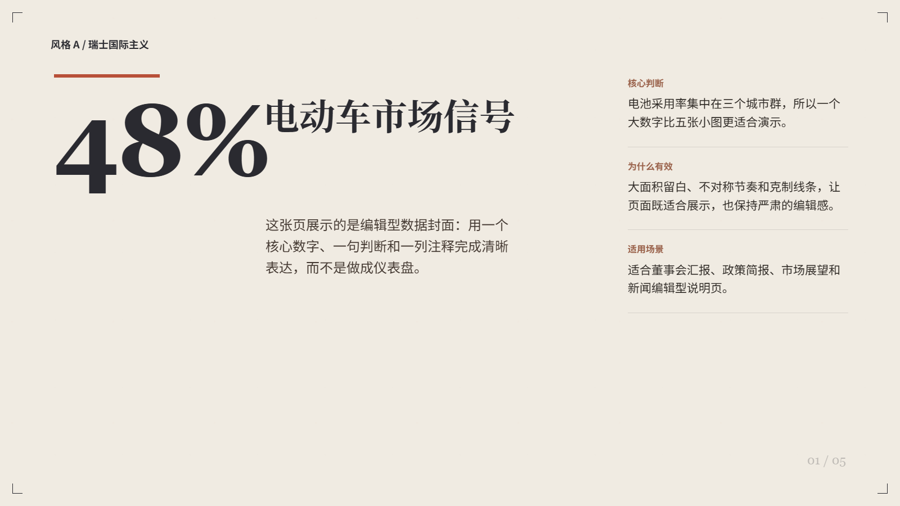
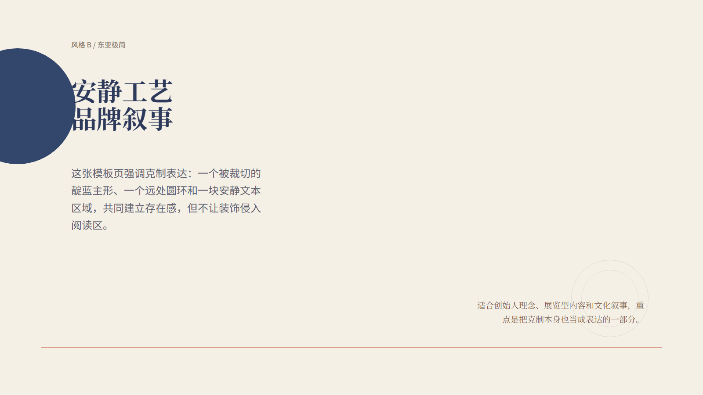
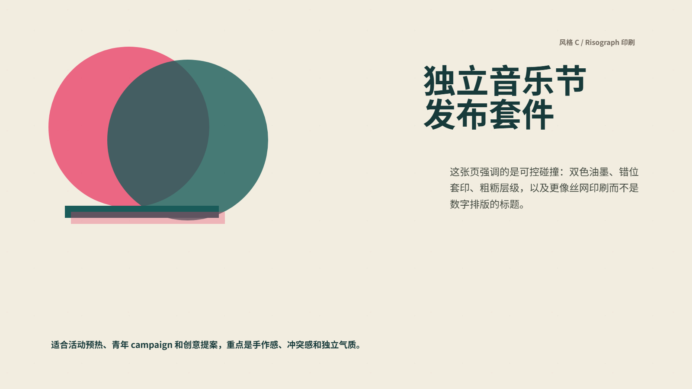
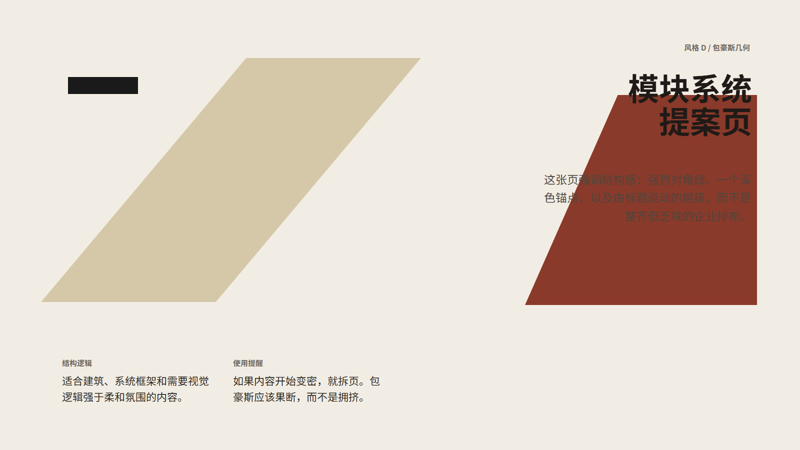
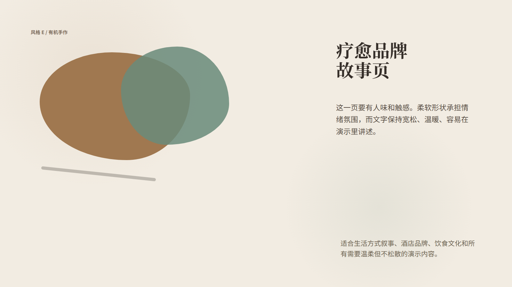
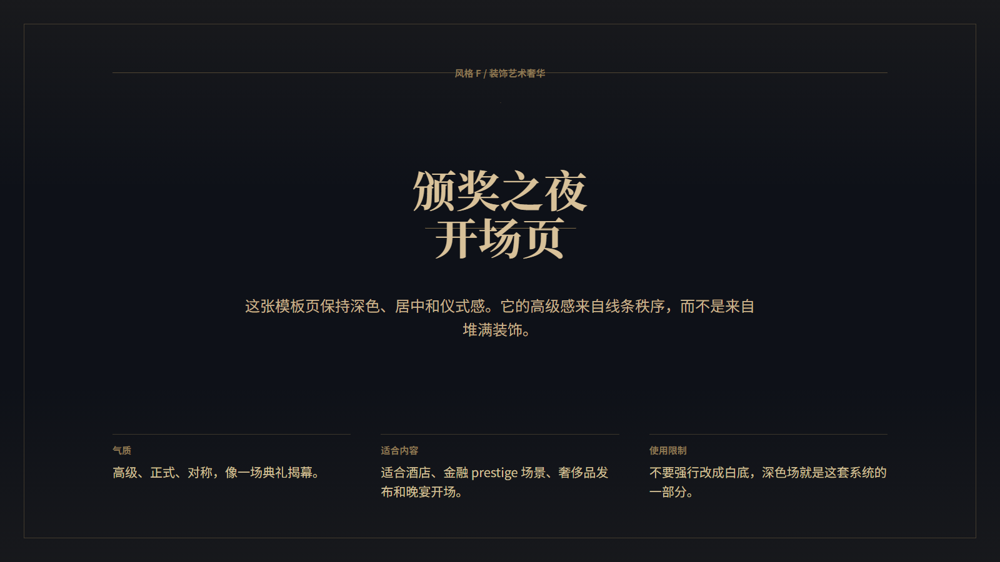
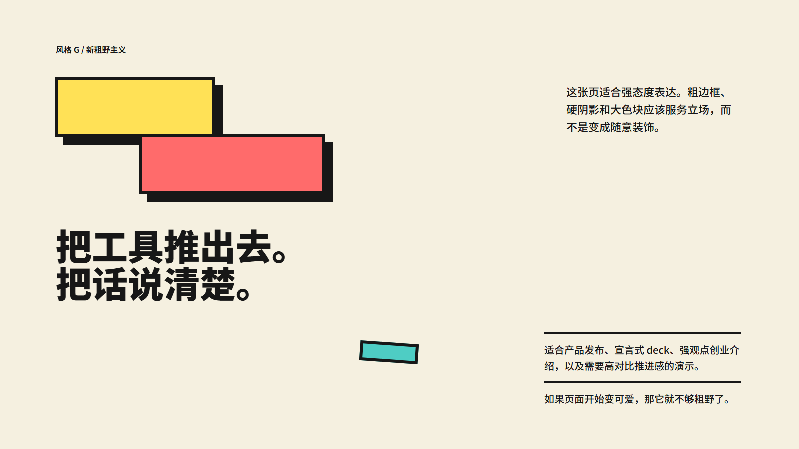
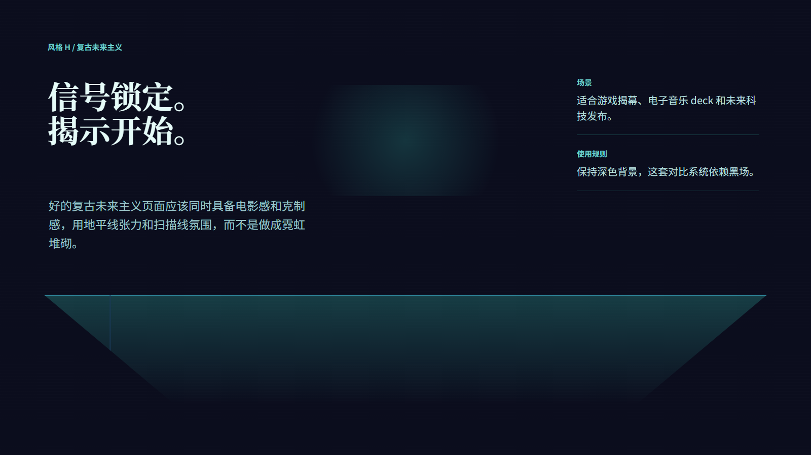
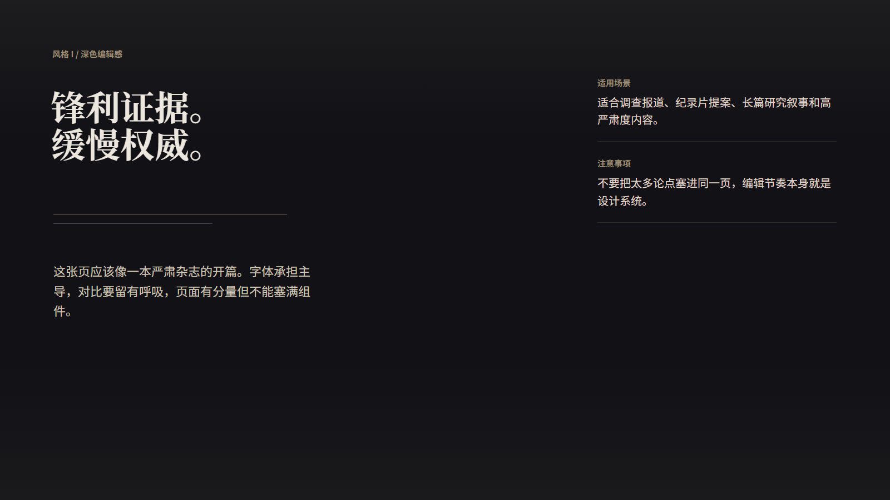

# PPT Design 中文说明

语言： [English](./README.md) | **简体中文** | [繁體中文](./README.zh-TW.md)

`ppt-design` 是一套面向演示稿设计的 skill，用来把按页组织好的 Markdown 转成 `1600x900` 的 HTML slides，并在需要时进一步导出成高保真的图片式 PPTX。

它同时面向 Codex 和 Claude Code 工作流。仓库根目录是完整开发工作区；`skills/ppt-design/` 是可分发的 skill bundle，镜像了共享的 skill 内容。

## 快速开始

1. 先执行 `npm install` 和 `npx playwright install chromium`。
2. 准备一份按 `Page 1`、`Page 2` 组织好的 Markdown。
3. 让 skill 自动推荐 style，或者直接指定 style。
4. 先生成 HTML slides，审查后再按需导出 PNG 或 PPTX。

如果你想直接开始使用，建议先从 [`cases/templates/`](./cases/templates/) 里的通用模板入手。

## 它能做什么

- 当用户未指定风格时，推荐合适的 style。
- 以按页组织的 Markdown 作为主要输入格式。
- 支持中文和中英混排，并按 style 应用不同字体配对规则。
- 支持兼容浅色风格的 `background_mode=paper|white`。
- 在写 HTML 前先识别每页内容角色，再选 layout prototype。
- 强制使用安全内容边界，保证主内容停留在演示安全区内。
- 每页生成后都做版式审查，检查越界、碰撞和可读性。
- 最终把 HTML slides 导出成 PNG，再导出成 PPTX。

## 典型使用场景

- 需要严谨层级和投影可读性的商业汇报、政策简报、研究总结。
- 需要比普通模板更强视觉方向的品牌、文化、展览型 deck。
- 需要按风格处理中英文字体关系的中文或双语演示稿。
- 需要通过静态 HTML 保真导出 PPTX，而不是依赖可编辑 PowerPoint 原生对象的场景。

## 当前工作流

核心工作流定义在：

- [`SKILL.md`](./SKILL.md)
- [`skills/ppt-design/SKILL.md`](./skills/ppt-design/SKILL.md)

关键参考文件链路如下：

1. [`references/style-selector.md`](./references/style-selector.md)
2. [`references/bilingual-typography.md`](./references/bilingual-typography.md)（仅中文或双语 deck 需要）
3. [`references/background-modes.md`](./references/background-modes.md)
4. [`references/presentation-layout-rules.md`](./references/presentation-layout-rules.md)
5. [`references/html-review-checklist.md`](./references/html-review-checklist.md)
6. [`references/layout-prototypes.md`](./references/layout-prototypes.md)
7. [`references/safe-zone.md`](./references/safe-zone.md)
8. 选中的 style 文件，位于 [`styles/`](./styles/)

整个流程是内容优先的：

1. 读取按 `Page 1`、`Page 2` 组织的 Markdown。
2. 识别每页属于 `cover`、`metric`、`comparison`、`closing` 等内容角色。
3. 根据 style family 和内容角色选择 layout prototype。
4. 保证主内容始终落在 slide safe zone 内。
5. 每页输出一个 HTML 文件。
6. 审查并修正后再交付。
7. 只在需要时导出 PPT。

## 版式与安全区约束

当前系统已经不是“整页随意铺内容”的模板，而是固定的 slide 合同：

- 画布：`1600 x 900`
- 主内容区：`y = 108px` 到 `y = 804px`
- 顶部预留区：`0-96px`
- 底部预留区：`804-900px`
- 所有主内容必须放在 `.main-frame` 内
- chrome labels 由 `chrome=all|bookend|none` 控制
- 默认 chrome 模式为 `bookend`

详见：

- [`references/layout-prototypes.md`](./references/layout-prototypes.md)
- [`references/safe-zone.md`](./references/safe-zone.md)

## 风格画廊

当前 skill 内置 10 套 style。先看截图总览，再决定是否深入阅读每套 style 的细则，会更像在看一份产品文档而不是纯文本说明。

### 一屏总览

| A. Swiss International | B. East Asian Minimalism |
|---|---|
|  |  |
| `editorial` • 网格明确、理性、编辑感 | `minimal` • 安静、留白大、克制 |

| C. Risograph Print | D. Bauhaus Geometry |
|---|---|
|  |  |
| `poster` • 独立印刷、分层、粗粝 | `geometry` • 结构强、大胆、现代主义 |

| E. Organic Handcrafted | F. Art Deco Luxury |
|---|---|
|  |  |
| `organic` • 温暖、有触感、人味重 | `luxury` • 深色、仪式感、对称 |

| G. Neo Brutalism | H. Retro Futurism |
|---|---|
|  |  |
| `brutal` • 高对比、硬边界、很直接 | `future` • 霓虹、地平线网格、复古科技 |

| I. Dark Editorial | J. Memphis Pop |
|---|---|
|  |  |
| `dark-editorial` • 高级、严肃、杂志感 | `playful` • 明亮、反网格、活泼 |

### 风格资料表

| Style | 名称 | Family | 适合内容 | `white` |
|---|---|---|---|---|
| A | Swiss International | editorial | 商业报告、金融、政策、新闻总结 | Yes |
| B | East Asian Minimalism | minimal | 品牌理念、展览、文化、哲思 | Yes |
| C | Risograph Print | poster | 创意提案、独立品牌、活动预热 | Yes |
| D | Bauhaus Geometry | geometry | 建筑、设计讲座、产品框架 | Yes |
| E | Organic Handcrafted | organic | wellness、餐饮、文化、生活方式叙事 | Yes |
| F | Art Deco Luxury | luxury | 奢侈品、酒店、颁奖、金融 prestige 场景 | No |
| G | Neo Brutalism | brutal | 创业发布、强态度 deck、产品宣言 | Yes |
| H | Retro Futurism | future | 游戏、科技发布、科幻主题、电子音乐 | No |
| I | Dark Editorial | dark-editorial | 调查、纪录片、深度研究 | No |
| J | Memphis Pop | playful | 教育、娱乐、社交 campaign、节庆 | Yes |

详细规则位于：

- [`references/style-selector.md`](./references/style-selector.md)
- [`styles/`](./styles/)

## 仓库结构

```text
ppt-design/
|- SKILL.md
|- CLAUDE.md
|- .claude/
|  `- settings.json
|- agents/
|  `- openai.yaml
|- references/
|  |- background-modes.md
|  |- bilingual-typography.md
|  |- deck-markdown-template.md
|  |- html-review-checklist.md
|  |- layout-prototypes.md
|  |- presentation-layout-rules.md
|  |- safe-zone.md
|  `- style-selector.md
|- styles/
|  |- style_a.md
|  |- ...
|  `- style_j.md
|- scripts/
|  |- render_slides.mjs
|  |- export_ppt.mjs
|  |- build_twitter_style_cases.mjs
|  |- build_review_sheets.mjs
|  |- generate_style_previews.mjs
|  `- twitter_style_cases/
|- skills/
|  `- ppt-design/
|     |- SKILL.md
|     |- references/
|     |- styles/
|     `- scripts/
`- outputs/
   |- html/
   |- rendered/
   `- ppt/
```

## 根目录与 skill bundle 的关系

仓库根目录是完整工作区，包含：

- `package.json` 和 `package-lock.json`
- 开发与审计脚本
- 预览资源
- 示例生成与审计脚本
- Claude Code 项目入口

`skills/ppt-design/` 是可分发的 skill 内容包，包含：

- 共享的 `SKILL.md`
- 共享 references
- 共享 styles
- 共享的 `render_slides.mjs` 与 `export_ppt.mjs`

这意味着：

- 两边核心 skill 工作流一致
- 根目录是完整超集
- `skills/ppt-design/` 适合拿去分发或安装
- 当前仓库里依赖安装仍然从根目录完成

## Claude Code 与 Codex 入口

Codex 风格入口：

- [`SKILL.md`](./SKILL.md)
- [`agents/openai.yaml`](./agents/openai.yaml)

Claude Code 项目入口：

- [`CLAUDE.md`](./CLAUDE.md)
- [`.claude/settings.json`](./.claude/settings.json)

## 环境准备

安装依赖：

```powershell
npm install
npx playwright install chromium
```

## 常用命令

HTML 渲染为 PNG：

```powershell
node .\scripts\render_slides.mjs --input .\outputs\html --output .\outputs\rendered
```

PNG 导出为 PPTX：

```powershell
node .\scripts\export_ppt.mjs --input .\outputs\rendered --output .\outputs\ppt\deck.pptx
```

两步一起执行：

```powershell
npm run build:ppt
```

生成 style 预览资源：

```powershell
npm run build:style-previews
```

运行完整的 10 套风格演示流水线：

```powershell
npm run build:twitter-cases
```

## PPT 导出元数据

PPT 作者与公司信息由环境变量控制：

```powershell
$env:PPT_AUTHOR = "Codex"
$env:PPT_COMPANY = "OpenAI"
```

如果未设置，则回退为：

- `PPT_AUTHOR`: `AI Agent`
- `PPT_COMPANY`: `PPT Design Skill`

## 推荐的 Markdown 输入方式

建议用户提供一份已经按页组织好的 Markdown。

例如：

```markdown
# Page 1
## 标题
2026 市场展望

## 副标题
为什么东南亚是下一阶段重点

## 要点
- 电动车渗透率集中在三个城市群提升
- 电池在地化让利润预期更清晰
- 各国政策支持力度仍然不平均

# Page 2
## 标题
关键驱动因素

## 模块
### 需求端
- 车队采购
- 城市充电增长
```

可复用模板：

- [`references/deck-markdown-template.md`](./references/deck-markdown-template.md)

## 模板库

现在仓库更强调“通用模板”作为起点，而不是把某一个具体主题案例当作产品基准。

推荐起始文件：

- [`references/deck-markdown-template.md`](./references/deck-markdown-template.md)
- [`cases/templates/five-slide-generic.md`](./cases/templates/five-slide-generic.md)
- [`cases/templates/five-slide-generic.zh.md`](./cases/templates/five-slide-generic.zh.md)
- [`cases/templates/ten-slide-generic.zh.md`](./cases/templates/ten-slide-generic.zh.md)

这些模板适合：

- 需要一个不绑定具体主题的中性结构
- 需要重复复用的 deck 骨架
- 先确定版式和层级，再填充实际内容

如果你只是想做内部验证，`npm run build:twitter-cases` 仍然保留作为演示脚本，但它不再作为面向产品文档的主案例。

## 质量标准

这套 skill 比普通 HTML 生成器更严格。

每一页最终都应满足：

- 文字不碰撞
- 内容不裁切
- 字号适合投影距离
- 长文本有清晰层级
- 留白与 padding 符合 slide 阅读逻辑
- 主内容全部位于 `.main-frame`
- 顶部和底部预留区没有误放正文
- 相邻页面不重复同一个 layout prototype

具体检查规则位于：

- [`references/presentation-layout-rules.md`](./references/presentation-layout-rules.md)
- [`references/html-review-checklist.md`](./references/html-review-checklist.md)

## 输出目录

- HTML slides: [`outputs/html/`](./outputs/html/)
- rendered PNGs: [`outputs/rendered/`](./outputs/rendered/)
- PPTX decks: [`outputs/ppt/`](./outputs/ppt/)

## 备注

- 根目录包含一些不在最小 skill 包中的辅助脚本与审计工具。
- `outputs/html/` 里的历史 smoke-test 文件只是本地产物，不代表当前标准模板。
- 一切最终行为以 `SKILL.md` 和 references 文档为准。
